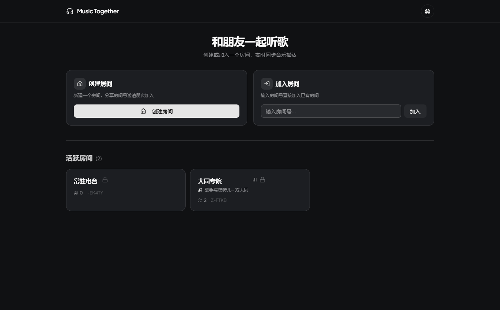
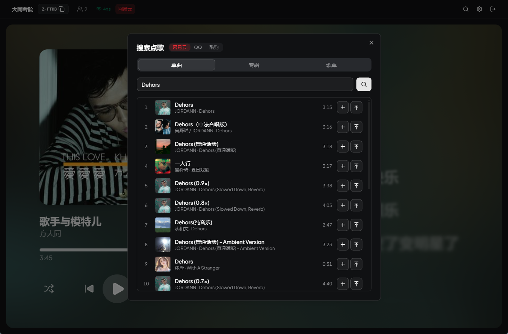
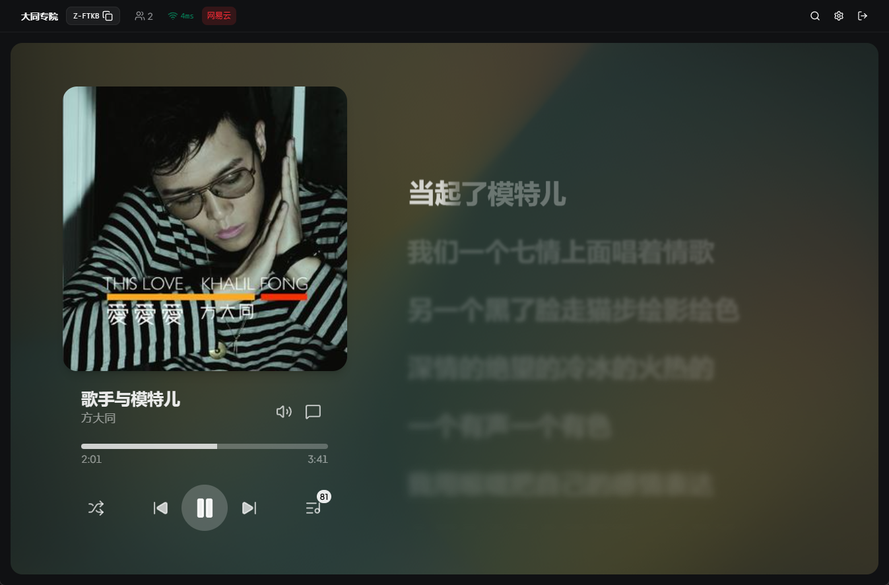
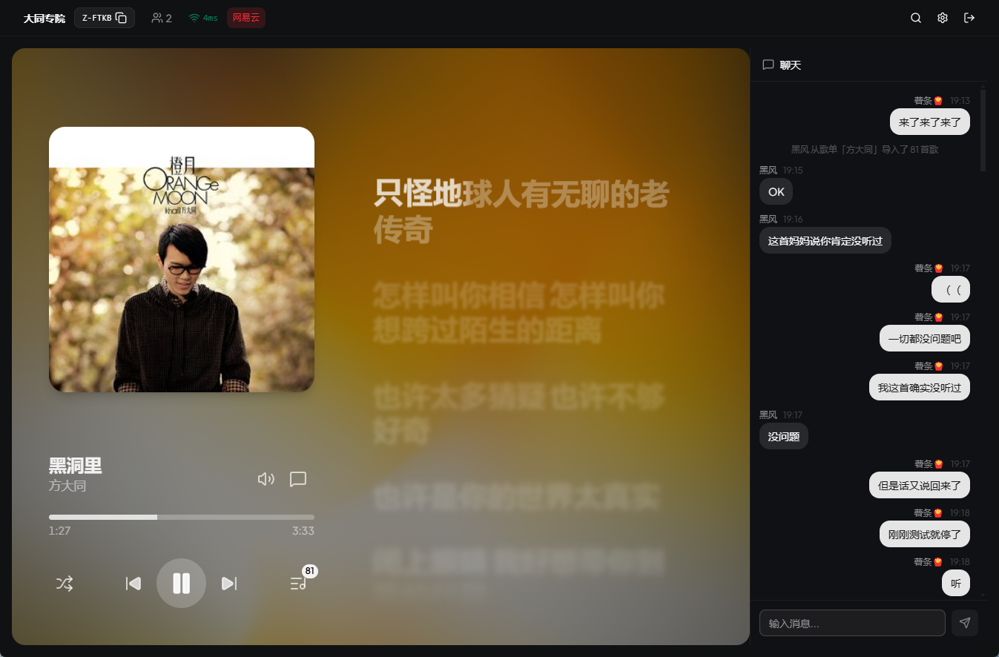
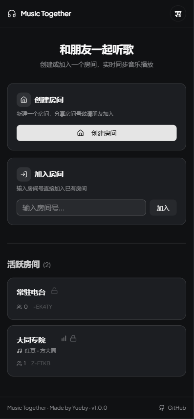
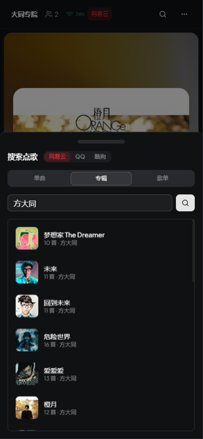
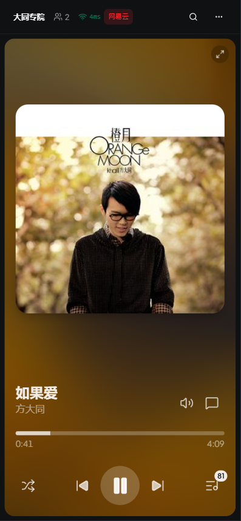
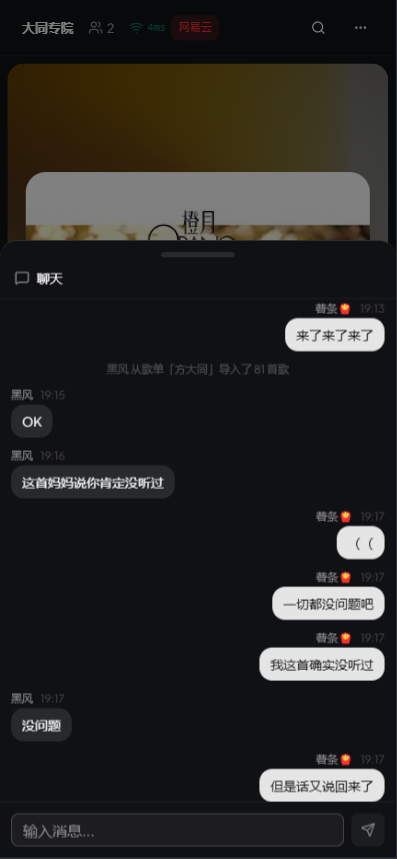
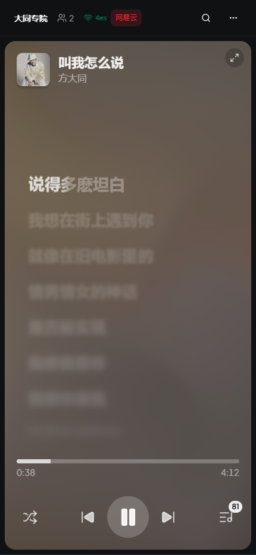

<p align="center">
  
</p>

<h1 align="center">Music Together Pro</h1>

<p align="center">
  Online multi-user synchronized music platform -- Create a room, invite friends, and listen to the same song together in real time. With UNM server support.
</p>

<p align="center">
  <a href="README.md">中文</a>
</p>

<p align="center">
  <a href="https://github.com/ChEnLeo-7/Music-Together-unm-support/stargazers"></a>
  <a href="https://github.com/ChEnLeo-7/Music-Together-unm-support/network/members"></a>
  <a href="https://github.com/ChEnLeo-7/Music-Together-unm-support/issues"></a>
  <a href="LICENSE"></a>
</p>

<p align="center">
  
  
  
  
  
  
</p>

## Screenshots

### Desktop

|            Home            |           Search           |           Player           |           Chat            |
| :------------------------: | :------------------------: | :------------------------: | :-----------------------: |
|  |  |  |  |

### Mobile

|            Home             |           Search            |           Player            |            Chat             |
| :-------------------------: | :-------------------------: | :-------------------------: | :-------------------------: |
|  |  |  |  |

### Lyrics Display Comparison

|         Desktop Lyrics         |      Portrait Default (Cover)      |        Portrait Lyrics Mode         |
| :----------------------------: | :--------------------------------: | :---------------------------------: |
|  |  |  |

## Reference Projects:
> - Original project [Yueby/music-together](https://github.com/Yueby/music-together)
> - Forked branch [Madokamaes/music-together](https://github.com/Madokamaes/music-together)

## Features of this branch (not in the original)

1. **⌨ Keyboard Shortcuts**: Quick access to corresponding interfaces (customizable keybindings)
2. **🧾 User Data Persistence**: Saves nickname, avatar, and identity to the database
3. **👁‍🗨 Chat History Visibility**: Setting to control whether new users can see historical chat messages when entering a room
4. **🔄 Manual Sync**: Supports manual sync trigger in Settings → Room, with higher frequency calibration
5. **🧪 Experimental Features**: Performance optimizations (not guaranteed smooth), click on lyrics to jump to the corresponding timestamp
6. **🪪 Server Admin Identity**: Allows dissolving any room, viewing account info, deleting accounts, resetting account passwords
7. **🎵 Audio Source & Quality Adjustment**: Supports adjusting audio source priority and quality priority, real‑time adjustment of current song quality
8. **👤 Guest Mode**: Enter a room with just a nickname, can later set a password to convert into a registered account
9. **🌐 Member Offline Persistence**: Saves member information after leaving a room (displayed as offline), this record can be deleted by the room owner
10. **🏠️ Hidden Rooms**: When enabled, the room is hidden from the lobby, but can still be accessed via the full room ID or invite link
11. **📒 Account Features**: Persistent account info, restore Cookie and room identity via login, permission support, avatar upload
12. **🎶 Broader Audio Source Support**: If logged into a music platform's VIP account, can access higher quality audio (Dolby not supported)
13. **🖥️ UNM Server Support**: Can be set via the environment variable `UNM_SERVER_URL` or in browser settings
14. **🌟 UI & Detail Optimizations**: Added full‑screen button, click lyrics to jump to timestamp, hide played lyrics (toggle), UI detail tweaks, layout improvements
15. **🏘️ Permanent Rooms**: When enabled, the room will not be destroyed except by the room owner or server admin (Cookie, UNM server info, etc., persist)
16. **Song/Album/Playlist ID Search**: Supports searching by NetEase Cloud `song`/`playlist`/`album` ID

## Important Note

This project was secondarily developed using AI (GPT‑5.5), adding UNM support and some personalized features. There may be minor bugs or imperfections (e.g., certain features may not work). Updates are not generally planned. If this causes any offense, please contact me to have it removed.

## Quick Start (Windows)

### Requirements

- Node.js >= 22
- pnpm >= 10

### Installation & Development

```bash
git clone https://github.com/ChEnLeo-7/Music-Together-unm-support.git
cd music-together
pnpm install
pnpm dev
```

Frontend: http://localhost:5173 | Backend: http://localhost:3001

## Docker Local Deployment

**Docker-Compose**:
``` Docker-Compose
services:
  music-together:
    build:
      context: .
      dockerfile: Dockerfile
    image: music-together:local
    container_name: music-together
    restart: unless-stopped
    ports:
      - "${HOST_PORT:-3001}:3001"
    environment:
      NODE_ENV: production
      PORT: 3001
      CLIENT_URL: "${CLIENT_URL:-}"
      CORS_ORIGINS: "${CORS_ORIGINS:-}"
      IDENTITY_SECRET: "${IDENTITY_SECRET:-dev-identity-secret-change-me}"
      IDENTITY_TTL_DAYS: "${IDENTITY_TTL_DAYS:-30}"
      IDENTITY_COOKIE_SECURE: "${IDENTITY_COOKIE_SECURE:-false}"
      REJOIN_TTL_MS: "${REJOIN_TTL_MS:-30000}"
      DATABASE_URL: "${DATABASE_URL:-file:/app/data/music-together.db}"
      SERVER_ADMIN_IDS: "${SERVER_ADMIN_IDS:-}"
      AUTO_FALLBACK_ENABLED: "${AUTO_FALLBACK_ENABLED:-true}"
      UNM_SERVER_URL: "${UNM_SERVER_URL:-}"
      UNM_SERVER_TIMEOUT_MS: "${UNM_SERVER_TIMEOUT_MS:-10000}"
    volumes:
      - music-together-data:/app/data
    networks:
      - music-together

networks:
  music-together:
    name: music-together

volumes:
  music-together-data:

```
**Dockerfile**
```
# syntax=docker/dockerfile:1

FROM node:22-alpine AS base
WORKDIR /app
RUN corepack enable

FROM base AS deps
RUN apk add --no-cache python3 make g++
COPY package.json pnpm-lock.yaml pnpm-workspace.yaml ./
COPY packages/shared/package.json packages/shared/package.json
COPY packages/server/package.json packages/server/package.json
COPY packages/client/package.json packages/client/package.json
RUN pnpm install --frozen-lockfile

FROM deps AS build
COPY packages/shared packages/shared
COPY packages/server packages/server
COPY packages/client packages/client
RUN pnpm build

FROM base AS prod-deps
RUN apk add --no-cache python3 make g++
COPY package.json pnpm-lock.yaml pnpm-workspace.yaml ./
COPY packages/shared/package.json packages/shared/package.json
COPY packages/server/package.json packages/server/package.json
COPY packages/client/package.json packages/client/package.json
RUN pnpm install --frozen-lockfile --prod --filter @music-together/server...

FROM node:22-alpine AS production
ENV NODE_ENV=production
ENV PORT=3001
WORKDIR /app

RUN apk add --no-cache vips

COPY package.json pnpm-lock.yaml pnpm-workspace.yaml ./
COPY packages/shared/package.json packages/shared/package.json
COPY packages/server/package.json packages/server/package.json
COPY packages/client/package.json packages/client/package.json
COPY --from=prod-deps /app/node_modules node_modules
COPY --from=prod-deps /app/packages/shared/node_modules packages/shared/node_modules
COPY --from=prod-deps /app/packages/server/node_modules packages/server/node_modules
COPY --from=build /app/packages/shared/dist packages/shared/dist
COPY --from=build /app/packages/server/dist packages/server/dist
COPY --from=build /app/packages/client/dist packages/client/dist

RUN sed -i 's|./src/index.ts|./dist/index.js|g' packages/shared/package.json \
  && mkdir -p /app/data

EXPOSE 3001
VOLUME ["/app/data"]
CMD ["node", "packages/server/dist/index.js"]

```

## Project Structure

```
packages/
  client/   -- Frontend React application
  server/   -- Backend Node.js service
  shared/   -- Shared types, constants, and permission definitions
```

## Acknowledgments

| Library                                                                                       | Description                      |
| --------------------------------------------------------------------------------------------- | -------------------------------- |
| [Howler.js](https://github.com/goldfire/howler.js)                                            | Web audio playback               |
| [Apple Music-like Lyrics](https://github.com/Steve-xmh/applemusic-like-lyrics)                | Lyrics component (GPL-3.0)       |
| [Meting](https://github.com/metowolf/Meting)                                                  | Multi-platform music API         |
| [NeteaseCloudMusicApi Enhanced](https://github.com/NeteaseCloudMusicApiEnhanced/api-enhanced) | NetEase Cloud Music API          |
| [CASL](https://github.com/stalniy/casl)                                                       | Permission management            |
| [Zustand](https://github.com/pmndrs/zustand)                                                  | State management                 |
| [shadcn/ui](https://github.com/shadcn-ui/ui)                                                  | UI component library             |
| [Motion](https://github.com/motiondivision/motion)                                            | Animation library                |
| [qq-music-download](https://github.com/tooplick/qq-music-download)                            | QQ Music login reference         |
| [UnblockNeteaseMusic](https://github.com/UnblockNeteaseMusic/server))                         |Unlock gray-area copyrighted music|

## License

[AGPL-3.0](LICENSE)
