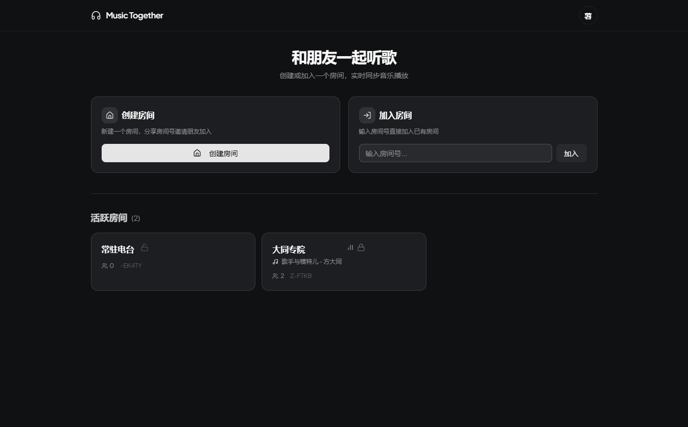
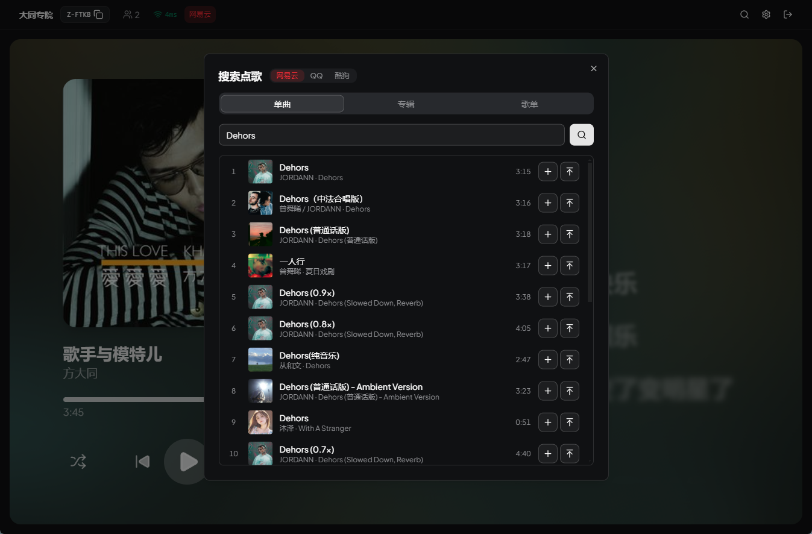
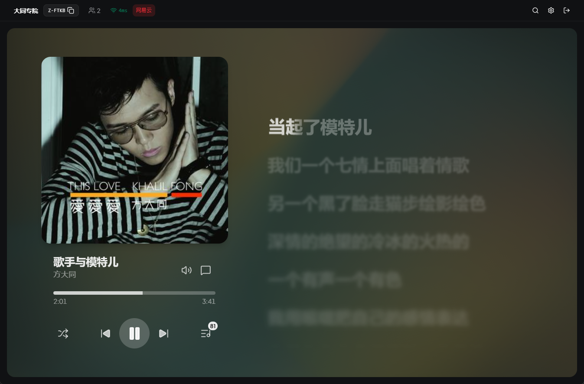
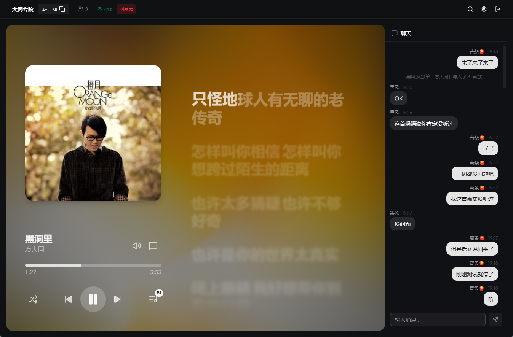
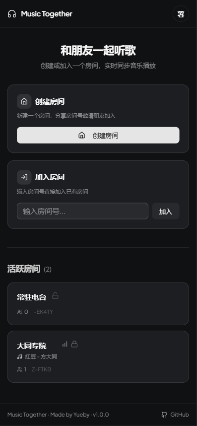
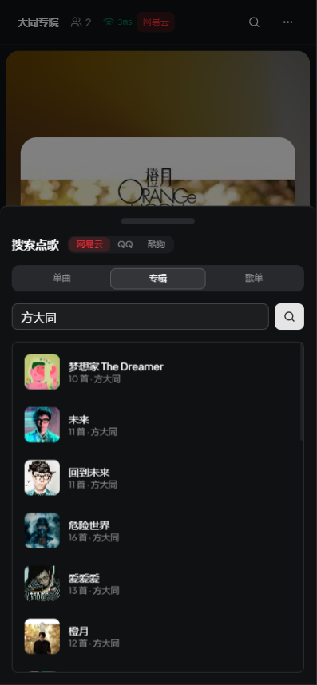
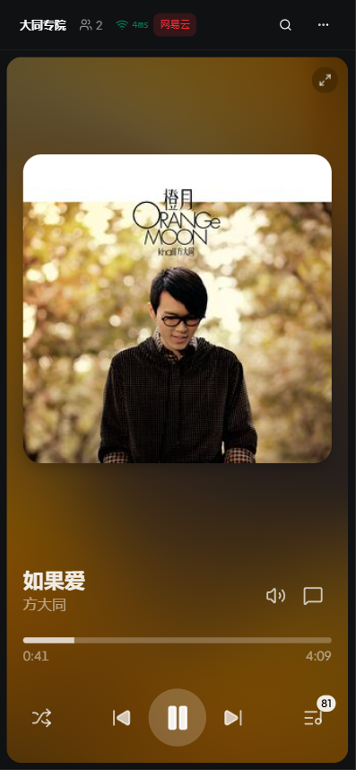
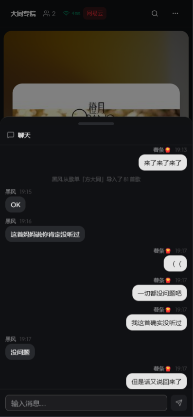
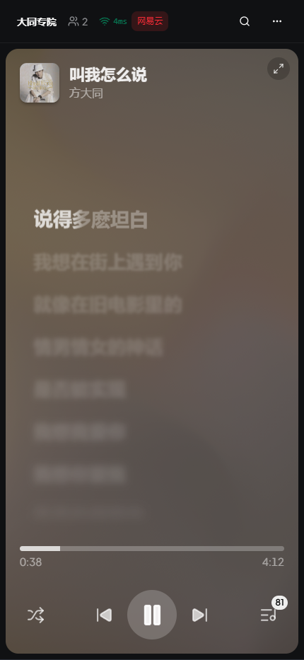

<p align="center">
  
</p>

<h1 align="center">Music Together Pro</h1>

<p align="center">
  在线多人同步听歌平台 -- 创建房间，邀请朋友，一起实时听同一首歌。支持 UNM 服务器
</p>

<p align="center">
  <a href="README.en.md">English</a>
</p>

<p align="center">
  <a href="https://github.com/ChEnLeo-7/Music-Together-unm-support/stargazers"></a>
  <a href="https://github.com/ChEnLeo-7/Music-Together-unm-support/network/members"></a>
  <a href="https://github.com/ChEnLeo-7/Music-Together-unm-support/issues"></a>
  <a href="LICENSE"></a>
</p>

<p align="center">
  
  
  
  
  
  
</p>

## 截图

### 桌面端

|            首页            |            搜索            |            播放            |            聊天            |
| :------------------------: | :------------------------: | :------------------------: | :------------------------: |
|  |  |  |  |

### 移动端

|             首页             |             搜索             |             播放             |             聊天             |
| :--------------------------: | :--------------------------: | :--------------------------: | :--------------------------: |
|  |  |  |  |

### 歌词展示对比

|            桌面端歌词            |         竖屏默认（封面）         |           竖屏歌词模式            |
| :------------------------------: | :------------------------------: | :-------------------------------: |
|  |  |  |

## 参考项目：
>- 原项目 [Yueby/music-together](https://github.com/Yueby/music-together)
>- 二改分支项目 [Madokamaes/music-together](https://github.com/Madokamaes/music-together)

## 该分支特性（原版不重复）

1. **⌨键盘快捷键**：快捷打开对应界面（可自定义键位）  
2. **🧾用户数据持久化**：保存昵称、头像、身份持久化到数据库  
3. **👁‍🗨聊天记录可见性**：设置可调整新用户进入房间是否能看见历史聊天记录  
4. **🔄手动同步**：设置-房间中，支持手动触发同步，更快频率的校准  
5. **🧪实验性功能**：点击歌词跳转到对应时间点
6. **🪪服务器管理员身份**：允许解散任意房间、查看账号信息、删除账号、重置账号密码  
7. **🎵音源音质调整**：支持调整音源优先级以及音质优先级，支持实时调整当前歌曲音质  
8. **👤游客模式**：只需要输入一个昵称即可进入房间，后续可以设置密码成为账号登录  
9. **🌐成员离线保存**：保存离开房间后的成员信息（显示离线），此信息记录可被房主删除  
10. **🏠️隐藏房间**：开启后隐藏房间在大厅显示，但是可以通过完整房间号和邀请链接进入  
11. **📒账号功能**：账号信息固化、通过登录恢复Cookie及房间身份、权限、支持上传头像  
12. **🎶更广的音源支持**：如果登录了音乐平台的VIP账号可以获取的更全的音质（似乎不支持杜比）  
13. **🖥️UNM服务器支持**：可以在环境变量 `UNM_SERVER_URL` 设置，或者浏览器设置中  
14. **🌟UI以及细节优化**：添加全屏按钮、点击歌词跳转对应时间点、隐藏已播放的歌词（开关）、界面细节优化调整、排版优化  
15. **🏘️永久房间**：开启后除了房主、服务器管理员能解散其他情况都不会销毁（Cookie、UNM服务器等信息会跟随保存）  
16. **歌曲/专辑/歌单 ID搜索**：支持用网易云的 `歌曲`/`歌单`/`专辑`ID 搜索
17. **Android 原生后台播放**：提供 Android App，通过 Media3 前台服务支持锁屏和后台播放、系统媒体控制、稳定的播放/暂停状态同步及可拖动进度条；App 启动时可连接自托管的 HTTP 或 HTTPS 服务器

## 温馨提示
本项目使用 GPT5.5 AI 二改而来，添加了 UNM 以及一些自己个性化需求的功能，可能会有些小bug小瑕疵（某个功能无效），一般不会有更新，如有冒犯，请联系我删除

## 快速开始 (Windows)

### 环境要求

- Node.js >= 22
- pnpm >= 10

### 安装与开发

```bash
git clone https://github.com/ChEnLeo-7/Music-Together-unm-support.git
cd music-together
pnpm install
pnpm dev
```

前端: http://localhost:5173 | 后端: http://localhost:3001

### Android App

从 [GitHub Releases](https://github.com/ChEnLeo-7/Music-Together-Pro-UNM-Support/releases/latest) 下载最新 APK 并安装。首次启动时输入 Music Together 服务端地址，例如 `https://music.example.com`；可信局域网调试也可使用 `http://192.168.1.10:3001`。

Android App 使用 Media3 前台播放服务，支持后台/锁屏播放和系统媒体控制。`v0.7.0` 修复了播放按钮状态不同步、缓冲时错误切换暂停状态、进度条触摸偏移与拖动回跳、重复执行播放指令，以及离开房间后原生服务未停止等问题。

## Docker 本地部署

仓库中的 `docker-compose.yml` 使用当前目录的源码在部署机器本地构建镜像，并包含健康检查、日志轮转和持久化数据卷：

```bash
cp .env.example .env
# 编辑 .env，至少填写三个必需密钥
docker compose up -d --build
docker compose ps
```

应用镜像不再从 GHCR 拉取。更新源码后，在项目目录执行 `docker compose up -d --build`，Docker 会为当前主机架构重新构建并重启服务；数据库仍保存在 `music-together-data` 数据卷中。

反向代理部署并设置 `TRUST_PROXY_HOPS=1` 时，应同时设置 `BIND_ADDRESS=127.0.0.1`，防止客户端绕过代理直接访问服务端口。

首次部署前先在 `.env` 中生成并填写密钥：

```bash
openssl rand -base64 32
openssl rand -base64 32
openssl rand -hex 32
```

前两个分别用于 `ROOM_PASSWORD_KEY` 和 `PLATFORM_AUTH_KEY`，第三个用于 `STREAM_PROXY_SECRET`。默认会话 Cookie 要求通过 HTTPS 访问；仅在可信局域网 HTTP 调试时才可设置 `SESSION_COOKIE_SECURE=false`。如果旧版本升级时启动日志报告 `Unversioned database schema detected`，必须先在宿主机备份 Docker 数据卷，再执行以下不兼容升级重置：

```bash
docker compose stop music-together
docker compose run --rm --build music-together node packages/server/dist/cli/resetAccounts.js --confirm=RESET-ALL-APPLICATION-DATA
docker compose up -d --build
```

重置会删除旧用户、永久房间、平台授权和头像。重新启动后使用一次性账号 `admin/admin` 登录，并按界面要求立即修改用户名和密码；完成后普通注册才会开放。

镜像构建细节以仓库根目录的 `Dockerfile` 为准，避免文档副本与实际生产镜像配置漂移。

## 项目结构

```
packages/
  client/   -- 前端 React 应用
  server/   -- 后端 Node.js 服务
  shared/   -- 共享类型、常量与权限定义
```

## 致谢

| 库                                                                                            | 说明               |
| --------------------------------------------------------------------------------------------- | ------------------ |
| [Howler.js](https://github.com/goldfire/howler.js)                                            | Web 音频播放       |
| [Apple Music-like Lyrics](https://github.com/Steve-xmh/applemusic-like-lyrics)                | 歌词组件 (GPL-3.0) |
| [Meting](https://github.com/metowolf/Meting)                                                  | 多平台音乐 API     |
| [NeteaseCloudMusicApi Enhanced](https://github.com/NeteaseCloudMusicApiEnhanced/api-enhanced) | 网易云音乐 API     |
| [CASL](https://github.com/stalniy/casl)                                                       | 权限管理           |
| [Zustand](https://github.com/pmndrs/zustand)                                                  | 状态管理           |
| [shadcn/ui](https://github.com/shadcn-ui/ui)                                                  | UI 组件库          |
| [Motion](https://github.com/motiondivision/motion)                                            | 动画库             |
| [qq-music-download](https://github.com/tooplick/qq-music-download)                            | QQ 音乐登录参考    |
| [UnblockNeteaseMusic](https://github.com/UnblockNeteaseMusic/server)                         |        解灰        |

## 协议

[AGPL-3.0](LICENSE)
